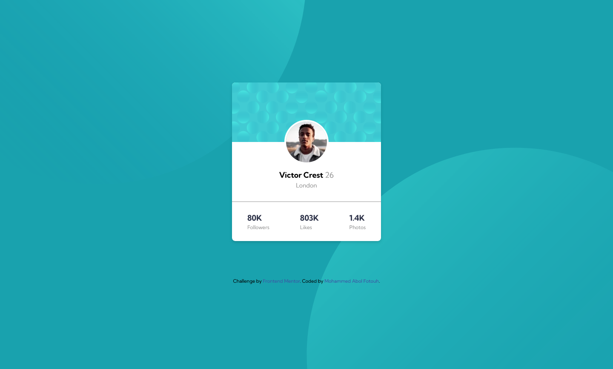
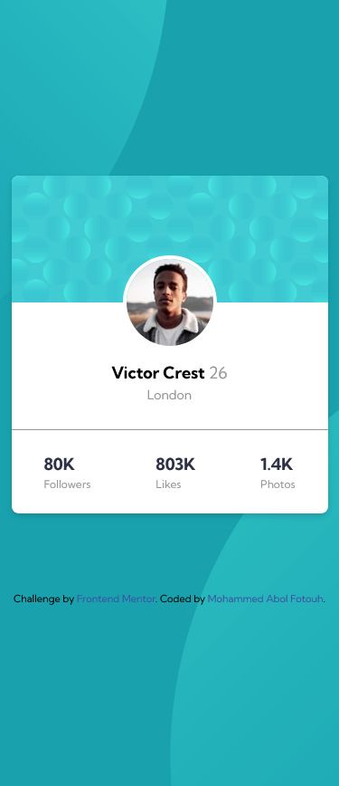

# Frontend Mentor - Profile card component solution

This is a solution to the [Profile card component challenge on Frontend Mentor](https://www.frontendmentor.io/challenges/profile-card-component-cfArpWshJ). Frontend Mentor challenges help you improve your coding skills by building realistic projects.

## Table of contents

- [Overview](#overview)
  - [The challenge](#the-challenge)
  - [Screenshot](#screenshot)
  - [Links](#links)
- [My process](#my-process)
  - [Built with](#built-with)
- [Author](#author)

## Overview

### The challenge

- Build out the project to the designs provided

### Screenshot

 

### Links

- Solution URL: [Add solution URL here](https://github.com/Mohammed-Abol-Fotouh/Profile-card-Component-FrontEndMaster)
- Live Site URL: [Add live site URL here](https://mohammed-abol-fotouh.github.io/Profile-card-Component-FrontEndMaster/)

## My process

### Built with

- Semantic HTML5 markup
- tailwind css
- CSS custom properties
- Flexbox

### What I learned

I exercised more in tailwind css.

## Author

- Github - [Mohammed-Abol-Fotouh](https://github.com/Mohammed-Abol-Fotouh)
- Frontend Mentor - [@Mohammed-Abol-Fotouh](https://www.frontendmentor.io/profile/Mohammed-Abol-Fotouh)
- LinkedIn - [Mohammed Abol Fotouh](https://www.linkedin.com/in/mohammed-abol-fotouh/)
